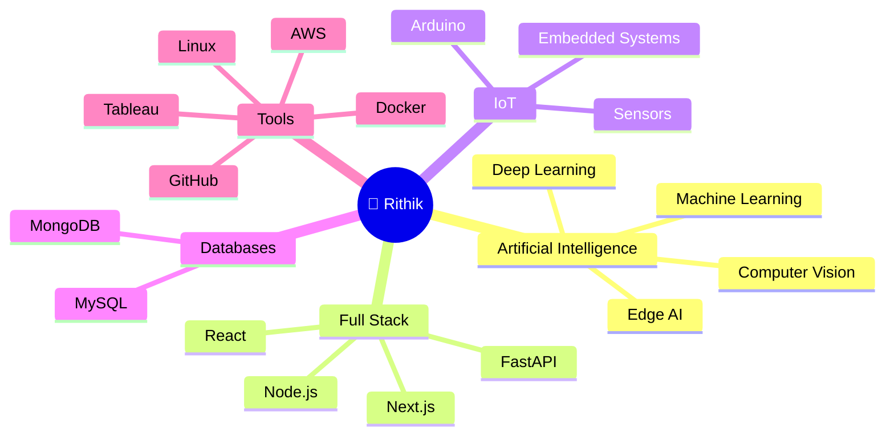

````markdown
<div align="center">

# 👋 Hey, I'm Rithik

### 🚀 AI Systems Engineer | Computer Vision | IoT + Full-Stack Developer

*Building real-world AI systems that combine software, hardware, and intelligence.*


<br>


</div>

---

# 🧠 About Me

💡 AI & Data Science undergraduate at **Karunya Institute of Technology and Sciences**

🤖 Passionate about **Computer Vision, Artificial Intelligence, Edge AI, IoT, and Full-Stack Development**

⚙️ Building intelligent applications that combine software, AI, and embedded hardware.

🚀 Exploring scalable AI deployment, multimodal vision systems, and high-performance computing.

🎯 **Vision:** Build intelligent technologies that solve real-world problems through innovation and engineering.

📫 **Email:** **sankarrithik5@gmail.com**

---

# 💻 Tech Stack

<p align="center">


</p>

---

# 📊 GitHub Analytics

<div align="center">


</div>

---

# 🔥 GitHub Streak

<div align="center">


</div>

---

# 📈 Activity Graph

<div align="center">


</div>

---

# 🧭 My Tech Universe



---

# 🚀 Featured Projects

| 🚀 Project | Description | Tech Stack |
|------------|-------------|------------|
| ⚽ **Football Video Analytics** | AI-powered football analytics with player tracking, ball detection, speed estimation & possession analysis | Python • OpenCV • YOLO • FastAPI |
| 📄 **AI Contract Risk Analyzer** | AI assistant that extracts clauses, detects risks, and answers legal questions | FastAPI • Sentence Transformers • SQLite |
| 💼 **AI Resume Builder** | ATS-friendly resume builder with AI content generation | React • Node.js • MongoDB |
| 🏥 **Sahayak Ecosystem** | AI-powered healthcare ecosystem with kiosk interface and admin dashboard | React • FastAPI • PostgreSQL |
| 🛰️ **AstroTrack** | Satellite and celestial object tracking platform with orbital visualization | Python • APIs • Matplotlib |
| 🦀 **ROGKBD** | Rust-based hardware utility for ASUS ROG keyboard customization | Rust • Linux |

---

# 🧪 Other Projects

- 🍽️ Food Waste Management Platform
- ❤️ Heart Disease Prediction System
- 📊 Pulse Analytics Dashboard
- 🎓 Smart Hall & Classroom Booking System
- 🤖 AI Chat Applications
- 🌐 Portfolio & Resume Platform

---

# 🏆 Achievements

✨ Full Stack Developer Intern – **Fludigo Pvt. Ltd.**

✨ Frontend Developer – **dot.dev Club, Karunya University**

✨ Built multiple production-ready AI applications using FastAPI & React

✨ Developed Computer Vision systems for sports analytics

✨ Experience with AI deployment on Render & Vercel

✨ Passionate about Open Source & Continuous Learning

---

# 🚀 Currently Working On

⚽ AI-powered Football Video Analytics

👕 Cherub — AI Fashion-Tech Platform

🤖 Local LLM & Edge AI Systems

📷 Advanced Computer Vision Applications

🦀 Learning Rust for Systems Programming

---

# 💭 Engineering Philosophy

> **Build systems that solve real problems—not just demos.**

- ⚡ Performance over complexity
- 🌍 Real-world deployment over experimentation
- 🧠 Systems thinking over isolated models
- 🚀 Learn. Build. Deploy. Improve.

---

# 🏅 GitHub Trophies

<div align="center">


</div>

---

# 🌐 Connect With Me

<p align="center">

<a href="https://rithiks.tech">

</a>

<a href="https://github.com/Rithikzz">

</a>

<a href="https://linkedin.com/in/rithik-s">

</a>

<a href="mailto:sankarrithik5@gmail.com">

</a>

</p>

---

# 🐍 Contribution Snake

> *(Enable this later using GitHub Actions.)*

```markdown

```

---

<div align="center">


### 💡 *"Building intelligent systems that bridge AI, software, and the physical world."*

⭐ **If you like my work, consider starring my repositories!**

</div>
````
