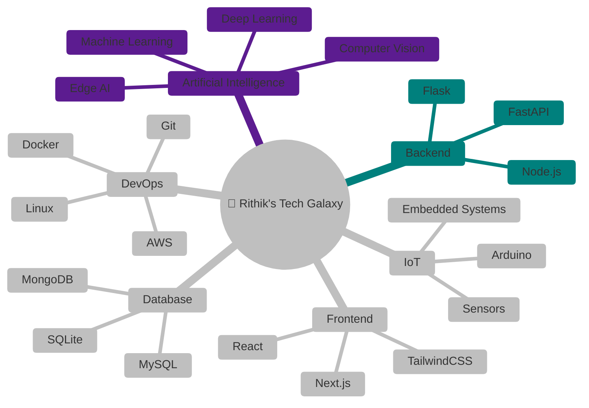

<!--
**Rithikzz/Rithikzz** is a ✨ special ✨ repository because its README.md appears on your GitHub profile.
-->

<div align="center">


</div>

---

## 🧠 About Me

💡 Passionate about **Artificial Intelligence, Computer Vision, IoT, and Full-Stack Development**.

🧠 Building intelligent systems that combine **AI, software engineering, and embedded hardware**.

⚙️ Experienced with **FastAPI, React, Next.js, OpenCV, Python, MongoDB, and Docker**.

🎯 Vision: **Build scalable AI systems that solve real-world problems beyond prototypes.**

📫 Reach me: **sankarrithik5@gmail.com**

---

## 💻 Tech Stack

<p align="center">
  
</p>

---

## ⚡ Engineering Dashboard

<p align="center">
  
</p>

---

## 🧭 My Tech Universe



---

## 🧩 Featured Projects

| 🚀 Project | Description | Tech Stack |
|------------|-------------|------------|
| **⚽ Football Video Analytics** | AI-powered football analytics with player tracking, speed estimation & possession analysis | Python • OpenCV • YOLO • FastAPI |
| **📄 AI Contract Risk Analyzer** | Intelligent legal document analysis with semantic search and AI Q&A | FastAPI • Sentence Transformers • SQLite |
| **💼 AI Resume Builder** | AI-powered ATS resume builder with intelligent suggestions | React • Node.js • MongoDB |
| **🏥 Sahayak Ecosystem** | Smart healthcare platform with kiosk interface and admin dashboard | React • FastAPI • PostgreSQL |
| **🛰️ AstroTrack** | Satellite and celestial object tracking platform | Python • APIs • Matplotlib |
| **🦀 ROGKBD** | Rust-based hardware utility for ASUS ROG keyboards | Rust • Linux |

---

## 🏆 Achievements

✨ Full Stack Developer Intern – **ELEVANCE SKILL.**

🚀 Frontend Developer – **dot.dev Club, Karunya University**

🤖 Built multiple production-ready AI applications using **FastAPI & React**

⚽ Developed **Computer Vision systems** for sports analytics

☁️ Deployed applications on **Render, Vercel, and cloud platforms**

📚 Passionate about Open Source, AI, and System Design

---

## 🚀 Currently Building

- ⚽ Football Video Analytics Platform
- 👕 Cherub – AI Fashion-Tech Platform
- 🤖 Local LLM & Edge AI Systems
- 📷 Advanced Computer Vision Applications
- 🦀 Exploring Rust for Systems Programming

---

## 📈 GitHub Activity

<p align="center">


<br><br>


</p>

---

## 🌐 Connect With Me

<p align="center">

<a href="mailto:sankarrithik5@gmail.com">

</a>

<a href="https://www.linkedin.com/in/rithik-s">

</a>

<a href="https://github.com/Rithikzz">

</a>

<a href="https://rithiks.tech">

</a>

</p>

---

<p align="center">
  

  <i>“Build intelligent systems that bridge AI, software, and the physical world.”</i>

  <br><br>

  ⭐ If you like my work, consider starring my repositories!

</p>
````
